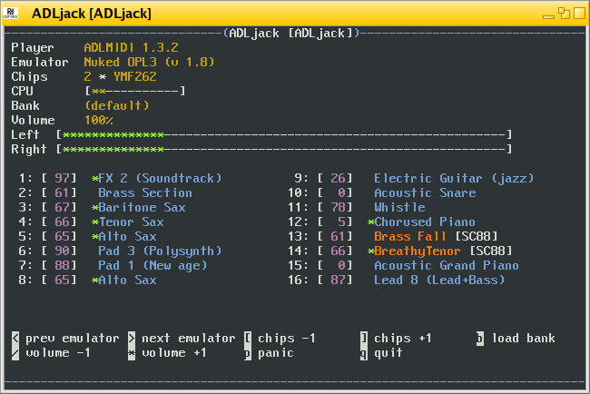

# adljack
OPL3/OPN2 synthesizer using ADLMIDI and OPNMIDI

This is a standalone synthesizer for ADLMIDI and OPNMIDI on the text console.
It is based on [libADLMIDI](https://github.com/Wohlstand/libADLMIDI) and [libOPNMIDI](https://github.com/Wohlstand/libOPNMIDI).

- *adljack* is the version for the Jack audio system.
- *adlrt* is the portable version for Linux, Windows and Mac.



## Feature list

- [x] Real time, low latency FM synthesizer
- [x] Support of multiple FM chip emulators
- [x] Support of multiple chips for extended polyphony
- [x] Loading instrument banks in WOPL and WOPN formats
- [x] General MIDI level 1 and 2
- [x] Multi-channel MIDI playback
- [x] Automatic bank reloading when the file changes on disk
- [x] User interface for the terminal with dynamic controls
- [x] Session management with the [NSM](http://non.tuxfamily.org/nsm/) protocol (adljack only)

## Usage

This is how you use adljack in the console.

* -h: Show a help message, and lists available players and emulators
* -p [player]: Selects the player. (ADLMIDI, OPNMIDI)
* -n [chips]: Defines the number of chips.
* -b [bank]: Loads the indicated bank file.
* -e [emulator]: Selects the emulator. (by number, as listed in -h)
* -L [latency]: (adlrt only) Defines the audio latency. The unit is milliseconds. Default 20ms.

## Development builds

[](https://semaphoreci.com/jpcima/adljack)

Find automatic builds of the development branch [here](http://jpcima.sdf1.org/software/development/ADLjack/) (Windows).

## Build instructions

Installed required dependencies:
- a C++ compiler for the 2011 standard
- at least one development package for audio, and one for MIDI: ALSA, PulseAudio, Jack
- either: (n)curses for a terminal interface, or SDL2 for a PDCurses pseudo-terminal (needed on Windows)

### Compiling

```
git clone --recursive https://github.com/jpcima/adljack.git
mkdir adljack/build
cd adljack/build
cmake -DCMAKE_BUILD_TYPE=Release ..
cmake --build .
```

### Installing

```
sudo cmake --build . --target install
```

## Questions

### Why are the colors odd-looking in a X11 terminal?

The default terminal setting may prevent the program from being able to define its own colors.
In the initialization of your shell, try setting a 256-color terminal type: `test "$TERM" = "xterm" && export TERM=xterm-256color`

## Change Log

### Version 1.2.0

- support of new emulators
- support of MIDI portamento
- support of OPN2 soft panning
- resolved a possible crash occurring on the PDCurses build

### Version 1.1.0

- ability to connect audio ports automatically using the option `-a`

### Version 1.1.0-rc.1

- fidelity improvement of DosBox, MAME and Gens emulators by processing at native sample rate
- update of the DosBox OPL emulator
- support of MIDI aftertouch
- fixed issues with pitch bend and pitch bend sensitivity
- support of Roland SC-55 sysex: text insert
- improved computation of the optimal 4 operator channel setting for OPL3
- fixed long notes cutting prematurely
- translation support on Windows
- various fixes

### Version 1.0.0

This is the initial release.
